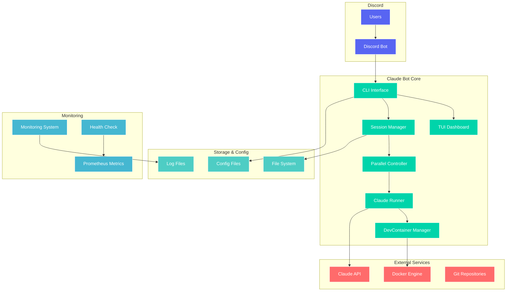
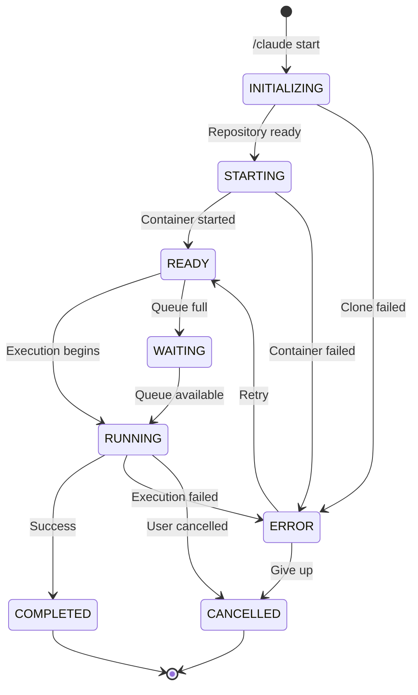
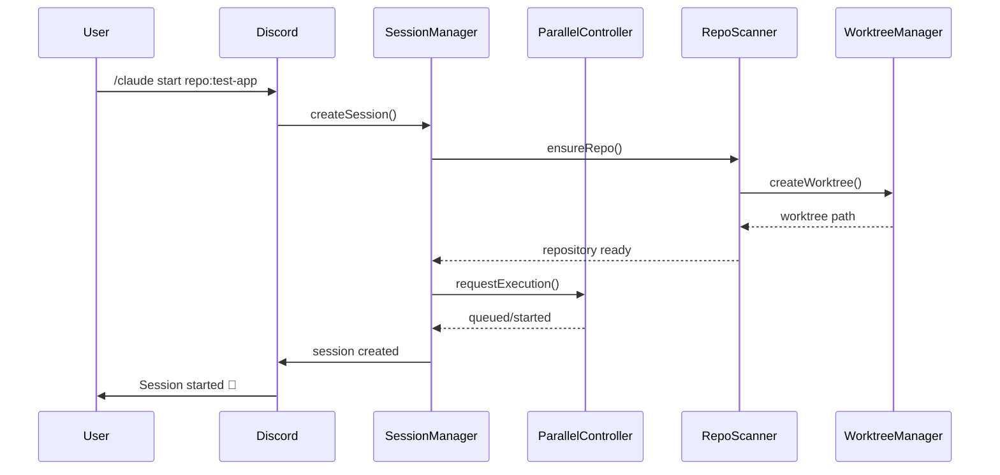
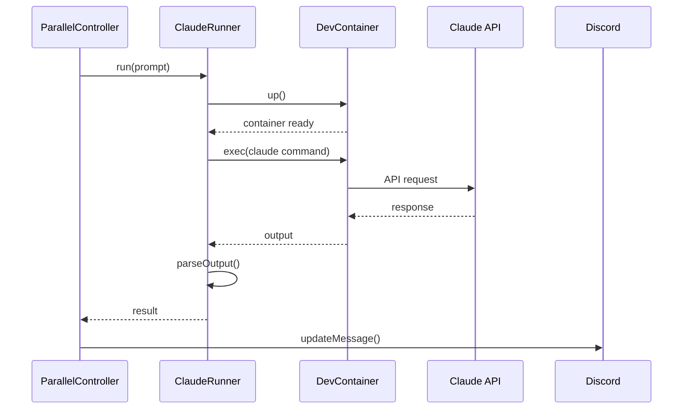
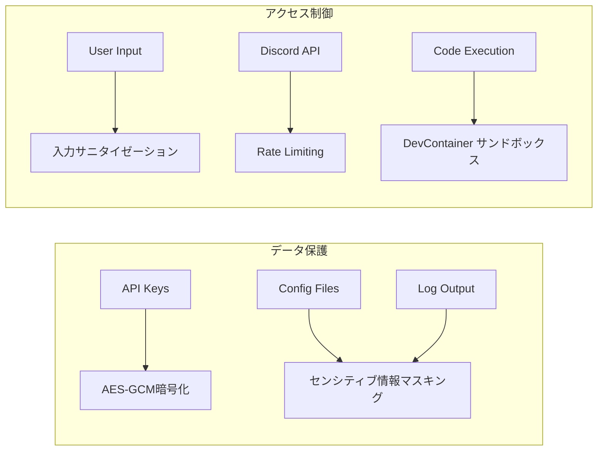
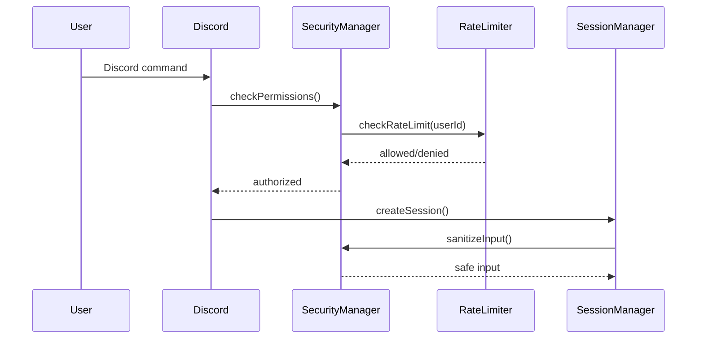
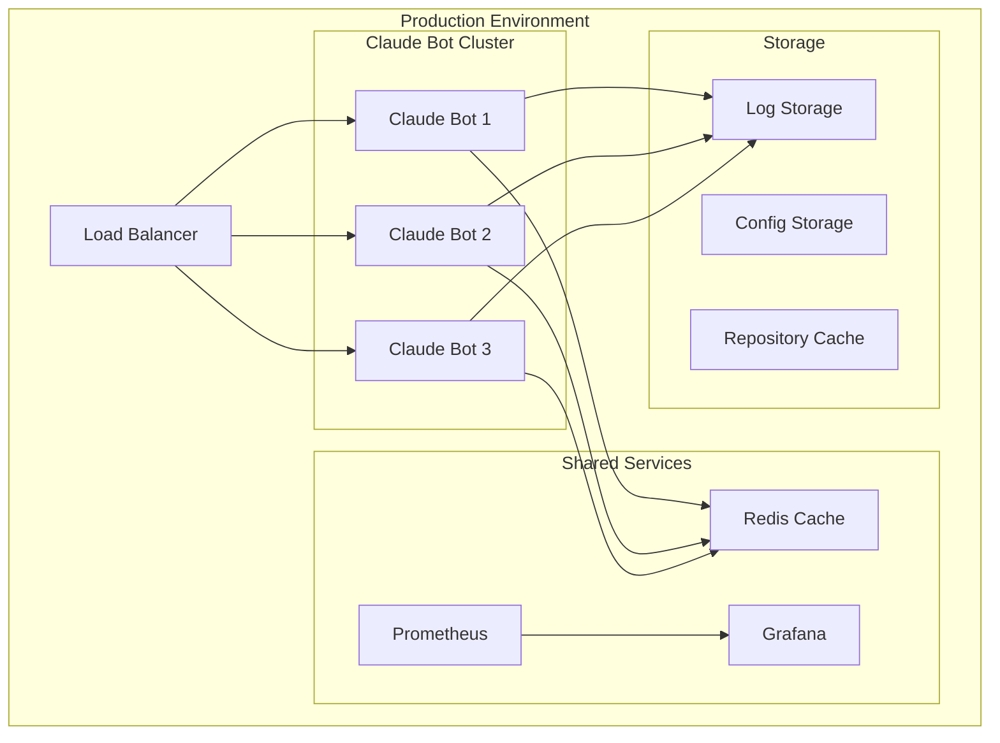
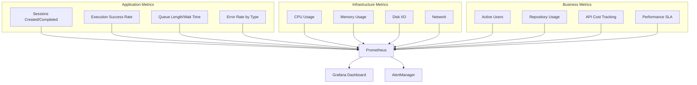
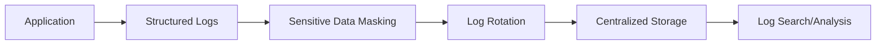

# Claude Bot アーキテクチャ概要

## 🏗️ システム全体図



## 🔄 セッションライフサイクル



## 🧩 コンポーネント詳細

### 1. Discord インターフェース

- **役割**: ユーザーとの対話窓口
- **技術**: Discordeno ライブラリ
- **機能**:
  - Slash コマンド処理
  - リアルタイム状態更新
  - インタラクティブUI（ボタン・モーダル）

### 2. セッション管理 (SessionManager)

- **役割**: セッションのライフサイクル管理
- **技術**: TypeScript、JSON永続化
- **機能**:
  - セッション作成・更新・削除
  - 状態遷移管理
  - イベント発火

### 3. 並列制御 (ParallelController)

- **役割**: 同時実行制限とキューイング
- **技術**: Semaphore パターン
- **機能**:
  - 最大同時実行数制御
  - 優先度付きキュー
  - デッドロック検出

### 4. Claude Runner

- **役割**: Claude Code CLI のラッパー
- **技術**: プロセス実行、ストリーミング
- **機能**:
  - 継続・プロンプトモード対応
  - 出力解析（diff、ファイル変更検出）
  - プロンプトテンプレート

### 5. DevContainer 管理

- **役割**: 隔離された実行環境の提供
- **技術**: devcontainer CLI、Docker
- **機能**:
  - コンテナライフサイクル管理
  - ヘルスチェック
  - リソース制限

## 🔧 データフロー

### セッション作成フロー



### Claude実行フロー



## 🗄️ データ構造

### セッションデータ

```typescript
interface SessionData {
  id: string; // 一意識別子
  threadId: string; // Discord thread ID
  repository: string; // リポジトリ名
  branch?: string; // ブランチ名
  worktreePath?: string; // worktree パス
  containerId?: string; // container ID
  state: SessionState; // 現在の状態
  metadata: {
    userId: string; // Discord user ID
    guildId: string; // Discord guild ID
    createdAt: Date; // 作成時刻
    updatedAt: Date; // 更新時刻
    priority?: number; // 優先度
  };
}
```

### 設定ファイル構造

```yaml
rootDir: ~/claude-work/repos
parallel:
  maxSessions: 3
  queueTimeout: 300
discord:
  guildIds: []
  commandPrefix: /claude
claude:
  model: claude-opus-4-20250514
  timeout: 600
logging:
  level: INFO
  retentionDays: 7
  maxFileSize: 10MB
```

## 🔒 セキュリティアーキテクチャ

### 暗号化レイヤー



### 認証・認可フロー



## 🚀 デプロイメント

### コンテナ化アーキテクチャ



### Kubernetes マニフェスト例

```yaml
apiVersion: apps/v1
kind: Deployment
metadata:
  name: claude-bot
spec:
  replicas: 3
  selector:
    matchLabels:
      app: claude-bot
  template:
    metadata:
      labels:
        app: claude-bot
    spec:
      containers:
        - name: claude-bot
          image: claude-bot:latest
          ports:
            - containerPort: 3000
          env:
            - name: ANTHROPIC_API_KEY
              valueFrom:
                secretKeyRef:
                  name: claude-secrets
                  key: api-key
          livenessProbe:
            httpGet:
              path: /health/liveness
              port: 3000
            initialDelaySeconds: 30
            periodSeconds: 10
          readinessProbe:
            httpGet:
              path: /health/readiness
              port: 3000
            initialDelaySeconds: 5
            periodSeconds: 5
```

## 📊 監視・可観測性

### メトリクス階層



## 🔄 スケーラビリティ戦略

### 水平スケーリング

- **ステートレス設計**: セッション状態は外部ストレージに保存
- **負荷分散**: Discord guild 単位での分散
- **キューイング**: Redis ベースの分散キュー

### 垂直スケーリング

- **リソース制限**: DevContainer のリソース制限
- **並列度調整**: 動的な maxSessions 調整
- **キャッシュ戦略**: Repository キャッシュとworktree再利用

## 🔧 運用・保守

### ログ管理



### バックアップ戦略

- **設定ファイル**: 定期的な設定バックアップ
- **セッション状態**: 永続化とスナップショット
- **リポジトリキャッシュ**: 増分バックアップ

### 災害復旧

- **RTO**: 5分以内の復旧
- **RPO**: 1分以内のデータ損失
- **冗長化**: マルチリージョン展開
